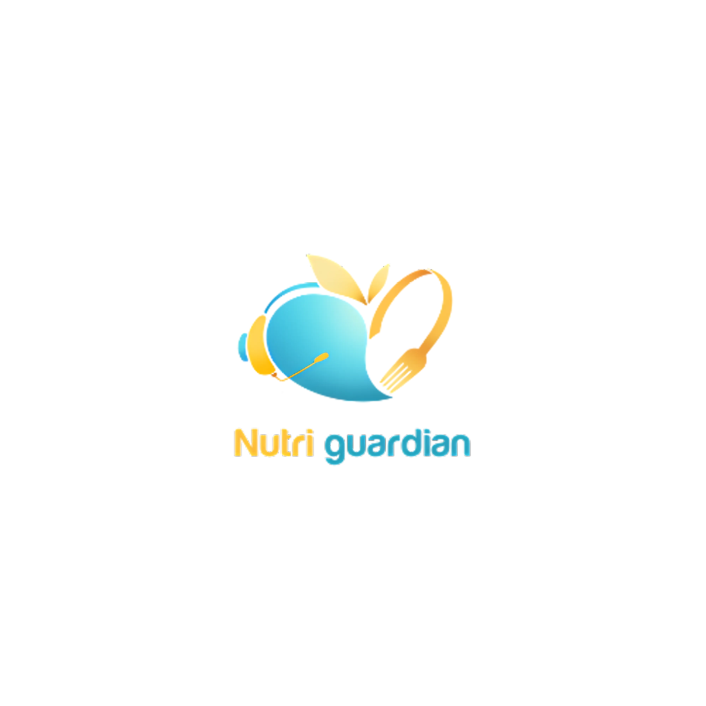
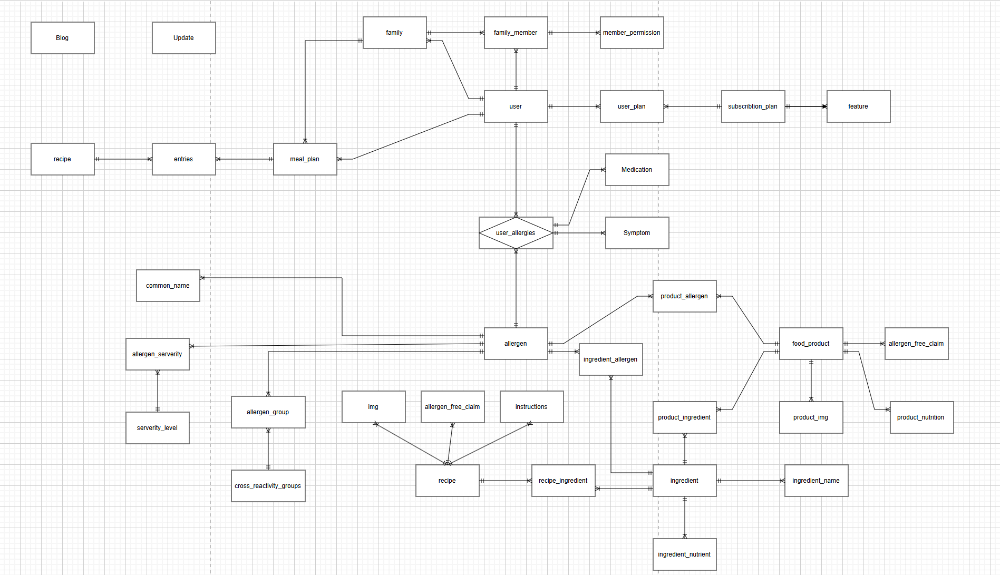
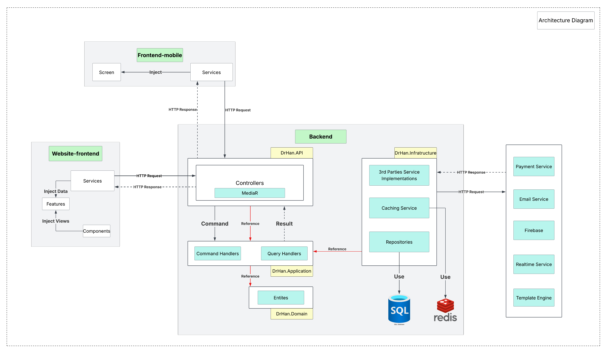

# Nutri Guardian -  Menu and Food Suggestion Application for People with Food Allergies

    
    
Nutri Guardian is a mobile application that provides menu and food suggestion application for people with food allergies.

 
 
 
 
 

 

## Table of Contents
<ol start="0"> 
    <li><a href="#intro">Introduction</a></li>
    <li><a href="#tech">Tech Stacks</a></li>
    <li><a href="#uc-diagram">Use Case Diagram</a></li>
    <li><a href="#uc-diagram">Architecture Diagram</a></li>
    <li><a href="#db-design">Database Design</a></li>
    <li><a href="#screen-flow"> Screen Flow</a></li>
    <li><a href="#team-members">Team Members</a></li>
</ol>

## 0. Introduction
Nutri Guardian Project was conceived to provide everyone, especially those who have difficulty choosing food due to allergies, a convenient application to help and suggest daily and weekly menus. Realizing that the technology era has developed as it is now, Nutri Guardian will bring a better experience by providing information as well as a platform to help users easily control their daily diet, to minimize risks as well as unwanted symptoms of food allergies anytime, anywhere. Minimize the disadvantages of having to receive direct advice from medical professionals and doctors.

## Core Features

- **Food Scanning and Recognition**: Users can take a picture of their food (or scan barcode) to check for any allergens.
- **Food Discovery & Recommendations**: Personalized Food Search Engine and AI-Powered Alternative Recommendations.
- **Meal Planning & Management**: Family Meal Planning System and Recipe Management with Allergen Analysis.
- **Family & Caregiver Features**: Family Management Dashboard and Caregiver Communication System.
- **Allergy Health Resources**: A curated library of materials, articles, and exercises for users about allergys.
- **AI Chatbot**: Users can chat with an AI chatbot to find out more about allergy.
- **Restaurant & Dining Out**: Allergy-Friendly Restaurant Finder and Restaurant Menu Scanner.

## Target Users

- **Primary Users**:
  - Caregiver
  - User with allergy
- **Secondary Users**:
  - Food reviewer
    

## 1. Tech Stacks

## Client & Server Technologies  

| Client | Description | Server | Description |
|--------|------------|--------|------------|
|  | Strongly typed JavaScript |  | Backend framework for building APIs |
|  | React framework with server-side rendering |  | ORM for database interactions |
|  | Mobile app development |  | Authentication and authorization |
|  | UI component library |  | Structured logging framework |
|  | Utility-first CSS framework |  | Job scheduling library |
|  | HTTP client for API requests |  | Token-based authentication |
| | |  | API testing tool |
| | |  | API documentation generator |
| | |  | Real-time communication |
| | |  | Decouples communication between components |
| | |  | Separates read/write operations |
| | |  | Microsoft Excel data processing |
| | |  | Email automation and integration |

---

## Database & API Deployment  

The **Database** stack includes data storage solutions, while **API Deployment** contains tools for containerization, automation, and cloud services.  

| Database | Description | API Deployment | Description |
|----------|------------|---------------|------------|
|  | Cloud-based relational database |  | Containerization platform |
|  | In-memory caching database |  | CI/CD automation |
| | |  | Backend deployment |
| | |  | Local development tunneling |

---

## Others  

Additional services and third-party APIs that enhance functionality, such as AI, payments, video streaming, and file storage.  

| Service | Description |
|---------|------------|
|  | AI-powered chatbot service |
|  | Online payment processing |
|  | Food infomation and meal planner |
|  | Image and video storage |

## 2. Use Case Diagram

## 3. Database Design

## 4. Architecture Diagram

## 5. Screen Flow

## 6. Team members
- [Nguyen Cao Tri](https://github.com/canxi4589): Back-End Developer, Probationary Front-End
- [Nguyen Tran Hong Phuc](https://github.com/PhucHong-6113): Back-End Developer
- [Huynh Minh Long](https://github.com/Dematto04): Web Front-End, Mobile Developer

# Appendix A
